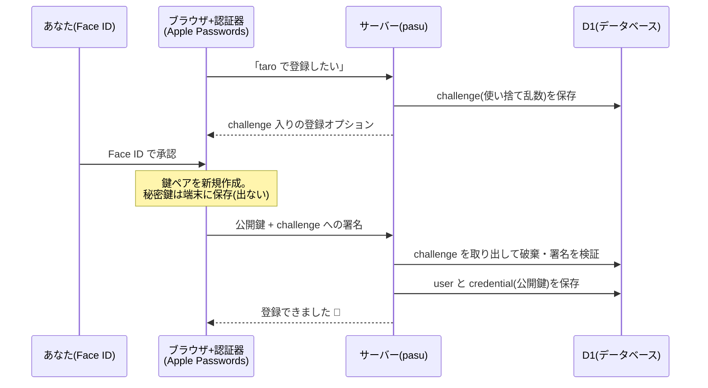
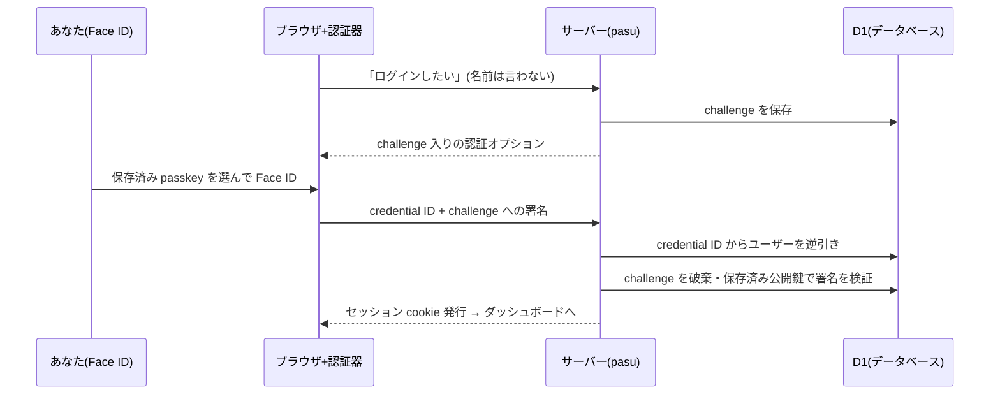

# pasu

passkey(WebAuthn)の学習用サンプルアプリ。

- SvelteKit (Svelte 5) + `@sveltejs/adapter-cloudflare`
- Cloudflare Workers + D1
- SimpleWebAuthn(登録・認証セレモニーの実装に使用)

## 30秒で分かる passkey

パスワードは「合言葉」。あなたとサーバーが同じ秘密を覚えておく方式なので、サーバーから漏れるし、偽サイトに入力すれば盗まれる。

passkey は「**銀行の印鑑照合**」。合言葉は存在しない。

- あなたは**実印**(秘密鍵)を自宅の金庫(iPhone の Apple Passwords 等)に持っている
- 銀行(このアプリ)には**印影**(公開鍵)だけを届けてある
- 窓口では、その場で渡される**毎回新しい書類**(challenge)に押印(署名)し、銀行が届け印と照合(検証)する

実印は家から出ないので、**銀行が泥棒に入られても盗まれるのは印影だけ**。印影から実印は作れない。書類(challenge)は毎回新しいので、昨日の押印書類を拾った人が窓口に出しても無効。

では泥棒が**偽の窓口**を構えて、本物の銀行から書類だけ取り寄せてあなたに押印させ、それを本物の窓口に持ち込んだら?(= フィッシング詐欺の手口)。これも失敗する:

- 金庫は「実印を作った銀行の窓口」でしか開かない。偽窓口(別ドメイン)では、そもそもこの銀行用の実印が候補に出てこない
- 仮に押印できたとしても、押印には**金庫自身が確認した「実際に押した場所」**が刻まれる。偽窓口で押した書類を本物の銀行に出すと、場所が合わず照合で弾かれる

場所を確認するのはあなたではなく金庫(ブラウザ)。**人間が偽サイトに騙されても、署名は騙されない**。これがフィッシング耐性の正体で、コードでは verify の `expectedOrigin` / `expectedRPID` の照合がこれにあたる。

## しくみ(図解)

**登録** = 実印を作って印影を届け出る手続き:



**ログイン** = 書類に押印して照合してもらう手続き。ユーザー名すら入力しない:



この2つの手続きを、WebAuthn の仕様書は**セレモニー(ceremony)**と呼ぶ。大げさな名前だが、意味は「決まった順番のやりとり」というだけ。種類もこの2つ(登録・認証)しかない。

## 用語と例えの対応表

| 用語                    | 例えで言うと                                     | このアプリでの実体                           |
| ----------------------- | ------------------------------------------------ | -------------------------------------------- |
| WebAuthn                | 印鑑照合のルールブック(W3C 標準)                 | SimpleWebAuthn 経由で利用                    |
| passkey                 | 実印(とその仕組み全体の愛称)                     | あなたが登録したもの                         |
| 秘密鍵 / 公開鍵         | 実印 / 印影                                      | 端末の中 / D1 の `credentials.public_key`    |
| 認証器(authenticator)   | 実印を保管する金庫                               | Apple Passwords、YubiKey 等                  |
| challenge               | 毎回新しく渡される書類                           | D1 の `challenges`(5分期限・使い捨て)        |
| セレモニー              | 窓口での一連の手続き                             | 登録と認証の2種類の 2往復                    |
| credential ID           | 印鑑の管理番号                                   | ダッシュボードに表示される ID                |
| RP / RP ID              | 銀行 / 銀行名                                    | このアプリ / `pasu.tommykey0925.workers.dev` |
| counter                 | 押印回数の記録(複製検出用)                       | ログインのたびに +1                          |
| AAGUID                  | 金庫のメーカー型番                               | 「Apple Passwords」の表示名の元              |
| discoverable credential | 「この銀行ならこの実印」と金庫が自力で探せること | ユーザー名レスログインを可能にする設定       |

## このアプリの機能

- **登録** — 上の図のとおり。ユーザー名はただの表示ラベルで、本人確認には使わない
- **ログイン** — ユーザー名レス。credential ID から逆引きし、セッション(D1 + httpOnly cookie、30日)を発行
- **追加** — 2本目以降の passkey。登録済みの認証器は `excludeCredentials` で弾く
- **削除** — 最後の1本だけはサーバー側で削除を拒否(消すと二度とログインできないため)
- **掃除** — 90日未使用のユーザーと期限切れ challenge を毎日 Cron で削除(`workers/cleanup`)

### コードの読み順と実装の要点

以下の抜粋は実コードから要点だけを残したもの。全体は各ファイルを参照。

**1. `src/routes/+page.svelte` — セレモニーのブラウザ側**

登録もログインも「options 取得 → ブラウザ API(OS の生体認証ダイアログが出る)→ verify に送る」の3行が本体:

```ts
const optionsJSON = await postJson('/api/register/options', { name });
const registration = await startRegistration({ optionsJSON }); // Face ID 等が出る
result = await postJson('/api/register/verify', registration);
```

**2. `src/routes/api/register/{options,verify}/+server.ts` — 登録セレモニー**

options 側。ライブラリ(SimpleWebAuthn)がオプション組み立てを担い、アプリは challenge の保存だけ自前で行う:

```ts
const options = await generateRegistrationOptions({
	rpName,
	rpID, // ドメイン名。署名に焼き込まれる
	userName: name,
	authenticatorSelection: {
		residentKey: 'required', // discoverable credential を強制(ユーザー名レスログインの前提)
		userVerification: 'preferred'
	}
});
const challengeId = await createChallenge(db, { challenge: options.challenge, ... });
cookies.set('reg_challenge', challengeId, { httpOnly: true, maxAge: 300 });
```

verify 側。challenge を取り出して(=同時に破棄して)検証し、通ったら保存:

```ts
const challenge = await consumeChallenge(db, challengeId, 'registration');
const verification = await verifyRegistrationResponse({
	response: body, // ブラウザから来た署名済みレスポンス
	expectedChallenge: challenge.challenge,
	expectedOrigin: origin,
	expectedRPID: rpID
});
const { credential, aaguid } = verification.registrationInfo;
await db.batch([
	/* INSERT users */
	/* INSERT credentials(公開鍵・counter・transports・AAGUID) */
]);
```

**3. `src/routes/api/login/{options,verify}/+server.ts` — 認証セレモニー**

options 側の肝は「何も指定しない」こと。`allowCredentials` を渡さないので、どの passkey を使うかはブラウザ/OS が選ぶ:

```ts
const options = await generateAuthenticationOptions({ rpID, userVerification: 'preferred' });
```

verify 側。飛んできた credential ID からユーザーを逆引きし、保存済み公開鍵で署名を検証する:

```ts
const row = await db
	.prepare('SELECT ... FROM credentials c JOIN users u ON u.id = c.user_id WHERE c.id = ?1')
	.bind(body.id) // credential ID
	.first();
const verification = await verifyAuthenticationResponse({
	response: body,
	expectedChallenge: challenge.challenge,
	expectedOrigin: origin,
	expectedRPID: rpID,
	credential: { id: row.id, publicKey: ..., counter: row.counter }
});
// counter を更新し、セッションを発行(ここで WebAuthn は終わり)
```

**4. `src/lib/server/challenge.ts` — challenge の使い捨て**

取り出しと削除を SQL 1文で行うのがポイント。検証が失敗しても challenge は消えているので再利用できない:

```ts
const row = await db
	.prepare('DELETE FROM challenges WHERE id = ?1 AND kind = ?2 RETURNING *')
	.bind(id, kind)
	.first();
if (!row || row.expires_at <= Date.now()) return null;
```

**5. `src/lib/server/session.ts` + `src/hooks.server.ts` — ログイン後の世界**

WebAuthn とは無関係な自前セッション。全リクエストの入口(hooks)で cookie を検証して `locals.user` に載せるだけ:

```ts
const user = await validateSession(event.platform.env.DB, sessionId);
if (user) event.locals.user = user;
```

**6. `src/routes/api/credentials/` + `src/routes/dashboard/` — 追加・削除・一覧**

追加は登録セレモニーの変形で、差分は2点だけ。既存ユーザーの id を使うことと、登録済み認証器を弾くこと:

```ts
userID: isoBase64URL.toBuffer(locals.user.id),
excludeCredentials: existing.map((row) => ({ id: row.id, transports: ... }))
```

削除のガードはサーバー側が本体(UI の無効化は補助)。「最後の1本を消すと二度とログインできない」ため:

```ts
if (!owned) return 'not_found';
if ((target?.total ?? 0) <= 1) return 'last_credential';
```

**7. `migrations/` — テーブル定義**

何を保存するか(=何を保存しなくてよいか)が一番よく分かる。`credentials` にあるのは公開鍵とメタデータだけで、パスワードのハッシュのような「漏れたら困る秘密」がどこにもないことに注目。

## ローカル開発

```bash
pnpm install
pnpm wrangler d1 migrations apply pasu --local   # ローカル D1 にスキーマ適用
pnpm dev
```

ローカルの D1 は `.wrangler/state/` 配下に保存される(Cloudflare へのログイン不要)。

## マイグレーション

スキーマ変更は `migrations/` に SQL ファイルを追加して管理する。

```bash
pnpm wrangler d1 migrations create pasu <name>   # 雛形作成
pnpm wrangler d1 migrations apply pasu --local   # ローカルへ適用
pnpm wrangler d1 migrations apply pasu --remote  # 本番へ適用
```

## デプロイ

本番 D1 の作成は初回のみ:

```bash
pnpm wrangler login
pnpm wrangler d1 create pasu   # 出力された database_id を wrangler.jsonc に反映
```

デプロイはマイグレーション適用 → deploy の順を守る:

```bash
pnpm wrangler d1 migrations apply pasu --remote
pnpm build
pnpm wrangler deploy
```

## テスト

```bash
pnpm test:unit   # Vitest
pnpm test:e2e    # Playwright(Chromium + WebAuthn Virtual Authenticator)
pnpm check       # wrangler types(型の再生成)+ svelte-check
```
